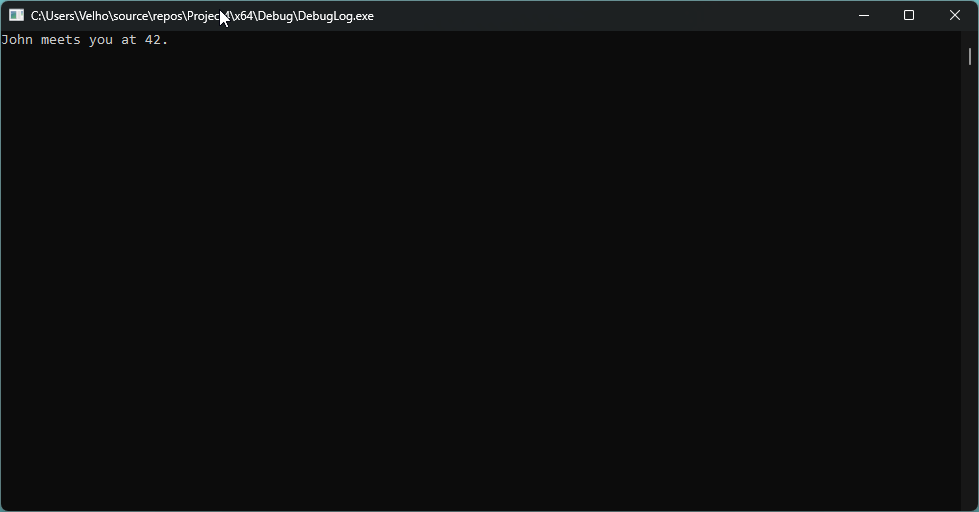

# DebugLog

## Description

This is a sample project formatting c style wide strings.
Built against the Subsystem:WINDOWS with UNICODE character set.
Expected to be part of a 3rd-party library and built as dll.

    DEBUG_LOG(L"%s meets you at %d.", L"John", 42);

## References

Write formatted output using a pointer to a list of arguments. [MSDN vsnprintf](https://learn.microsoft.com/en-us/cpp/c-runtime-library/reference/vsnprintf-vsnprintf-vsnprintf-l-vsnwprintf-vsnwprintf-l?view=msvc-170)
